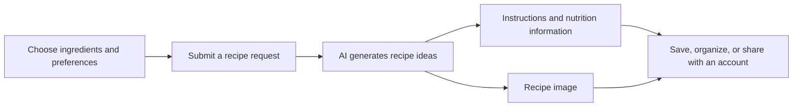

# How Ingredient Alchemist Works

Ingredient Alchemist helps turn ingredients and cooking preferences into recipe ideas. This overview describes the experience in broad terms and intentionally omits internal service flows and security details.

## 1. Choose what matters

Enter ingredients and select preferences such as dietary needs, allergies, available cooking equipment, and cooking time. Avoid entering sensitive personal information; recipe requests are processed by Google Gemini.

## 2. Explore recipe ideas

The app uses Google Gemini to generate recipe ideas, step-by-step instructions, and nutrition information. AI-generated recipe imagery and suggestions for additional ingredients are also available.

## 3. Keep or share recipes

When signed in, you can save recipes, organize favorites, search your recipe history, and share recipe pages. Firebase services support accounts and saved recipe data.

## Data and safety

For a summary of information processed by the app, see [Privacy / Data in the README](README.md#privacy--data). The [Privacy Policy](https://ingredientalchemist.com/privacy-policy), [Cookie Policy](https://ingredientalchemist.com/cookie-policy), and [Third-party services notice](https://ingredientalchemist.com/third-party) contain the current detailed policies.

AI output can be inaccurate or incomplete. Dietary and allergy preferences do not guarantee that generated recipes are safe. Check ingredients, food labels, preparation steps, and cooking temperatures yourself. Ingredient Alchemist is not medical or professional nutrition advice.